# IoTLogic 도움말
유덕남 ([yoo2001818@gmail.com](mailto:yoo2001818@gmail.com))  
버전 1.0.0, 2016년 7월 25일  

# 목차

- 소개
- 웹 프론트엔드 가이드
  - 구성
  - 계정 관리
  - 홈
  - 장치
    - 만들기
    - 정보 수정하기
      - 웹 리모컨
      - I/O 패키지
  - 스크립트
    - 만들기
    - 정보 수정하기
    - 스크립트 수정하기
    - 콘솔 사용하기
- 프로그래밍 가이드
  - 구성
  - 주의 사항
  - IoTLogic 내장 함수
    - I/O 사용하기
  - I/O 패키지 레퍼런스
    - cron
    - node-notifier
    - process
    - remote
    - wiring-pi
    - 패키지 만들기
  - 장치 레퍼런스
    - 웹 리모컨
- 라이센스

# 소개
IoTLogic은 인터넷 상에 연결되어 있는 여러 장치를 장치별로 프로그램을 따로 작성하지 않고
하나의 프로그램만을 작성해서 손쉽게 제어할 수 있게 해주는 플랫폼입니다.

IoTLogic은 웹 프론트엔드, 메시징 서버와 클라이언트 노드 3가지로 구성되어 있습니다.
- 웹 프론트엔드에서는 장치와 스크립트를 관리할 수 있는 기능을 웹 브라우저에서 제공합니다.
- 메시징 서버는 웹 프론트엔드, 클라이언트 노드에서 받은 명령을 다른 노드로 보내는 등의
  릴레이 동작을 수행합니다.
- 클라이언트 노드에서는 메시징 서버와 연결해 스크립트를 실행하며 필요로 하는 I/O를 실행합니다.

# 웹 프론트엔드 가이드
IoTLogic의 웹 프론트엔드에 대해 설명합니다.

## 구성
웹 프론트엔드는 크게 다음과 같은 기능을 가지고 있습니다:

- 계정 관리
- 장치 관리
  - 웹 리모컨
  - I/O 패키지 관리 (PC 장치에서만)
- 스크립트 관리
  - 스크립트 수정
  - 콘솔
  - 에러 보기

## 계정 관리

### 로그인
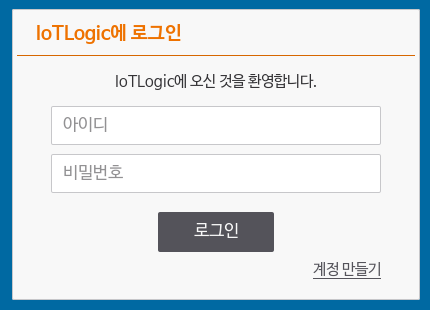

사이트에 접속하면 맨 처음으로 로그인 화면이 나타납니다. 로그인하지 않으면 서비스를 이용할 수
없어 꼭 로그인을 해야 합니다. 계정이 없다면 계정 만들기 화면으로 이동할 수 있습니다.

### 계정 만들기
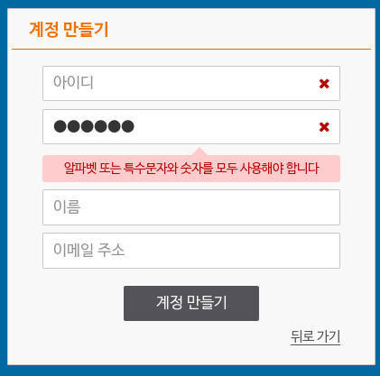

계정 만들기 화면에서 계정을 만들 수 있습니다. 아이디, 비밀번호, 이름, 이메일 주소를 입력하면
회원가입이 끝나고 홈으로 이동하게 됩니다.

### 계정 설정
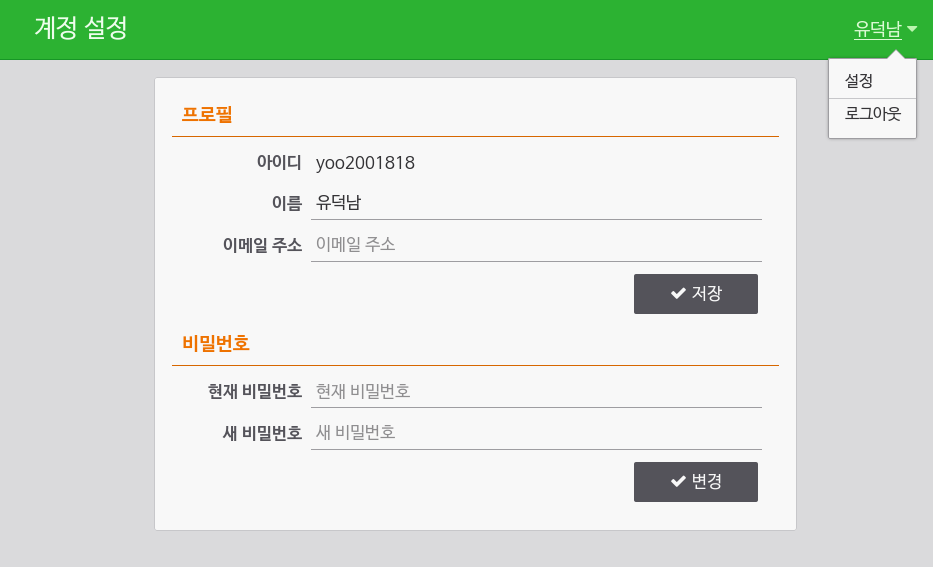

로그인이 끝나고 우측 위의 설정 버튼을 누르면 비밀번호, 이름, 이메일 주소를 변경할 수 있습니다.

## 홈
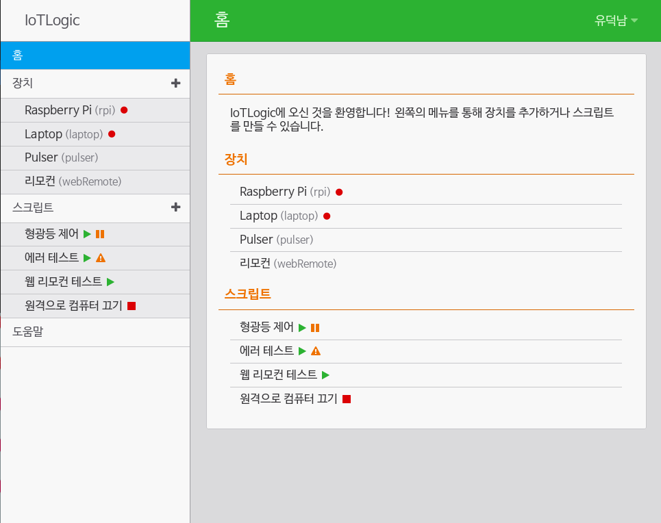
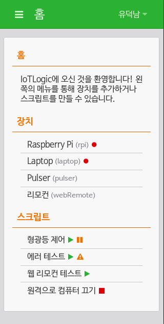

홈 화면에서는 사용자가 등록한 장치와 스크립트가 전부 나열됩니다. 화면 크기가 작아지면
왼쪽 메뉴(햄버거 메뉴)가 사라지는데, 이런 환경에서도 편리하게 페이지를 넘길 수 있게 됩니다.

## 장치
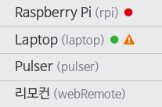

장치 오른쪽에는 이런 작은 아이콘이 표시되는데, 연결 상태와 에러 여부를 표시합니다.
PC (Node.js) 유형의 장치가 아닌 경우에는 아이콘이 표시되지 않습니다.

### 만들기
TODOTODOTODO
TODOTODOTODO
TODOTODOTODO
TODOTODOTODO
TODOTODOTODO
<p style="font-size: 200pt;">TODO!</p>

### 정보 수정하기
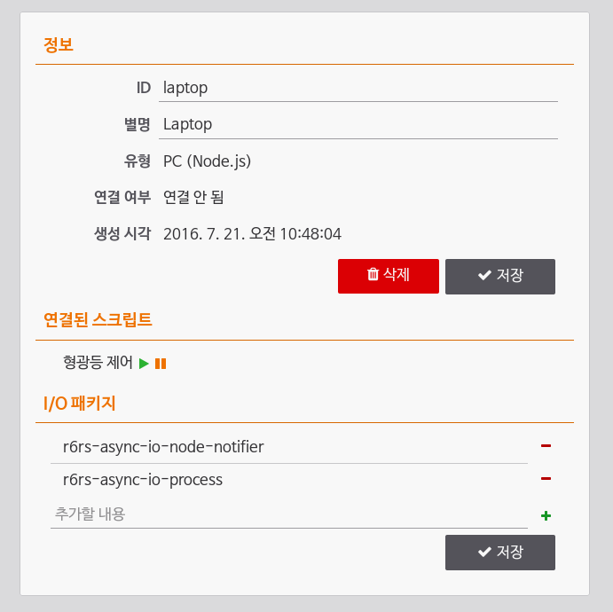

장치를 선택하면 해당 장치에 대한 자세한 사항이 표시됩니다. 장치의 ID와 별명을 수정할
수 있고, 장치에 연결된 스크립트를 볼 수 있고, 추가적으로 장치 유형에 따라서 여러 필드가
더 나타납니다.

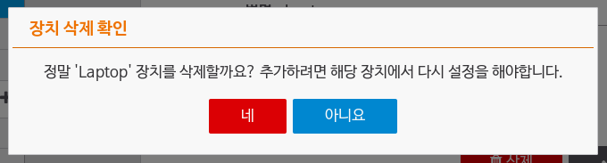

삭제 버튼을 누르면 이렇게 창이 나타나서 확실하게 삭제할 건지 물어봅니다.

#### 웹 리모컨


웹 리모컨 유형의 장치 상단에는 스크립트에서 설정된 리모컨이 나타나서 장치를 웹에서 편리하게
제어할 수 있습니다. 내부적으로 REST API를 사용하므로 필요하다면 다른 프로그램에서도 이를
호출할 수도 있습니다.

#### I/O 패키지
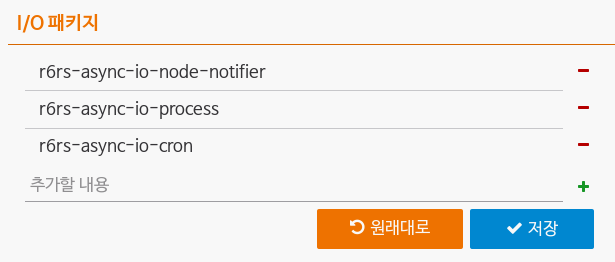

PC (Node.js) 유형의 장치 하단에서 장치에서 사용하는 I/O 패키지를 등록할 수 있습니다. 이
패키지는 [npm](http://npmjs.com/)에서 받아서 설치하게 됩니다.

## 스크립트
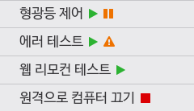

스크립트 오른쪽에도 작은 아이콘이 표시되는데, 스크립트 실행 여부와 일시 정지 여부, 에러 여부를
나타냅니다.

### 만들기
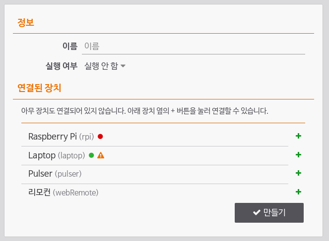

메뉴의 스크립트 오른쪽의 + 버튼을 누르면 스크립트를 만들 수 있습니다. 이름과 실행 여부,
연결할 장치들을 설정할 수 있습니다.

### 정보 수정하기
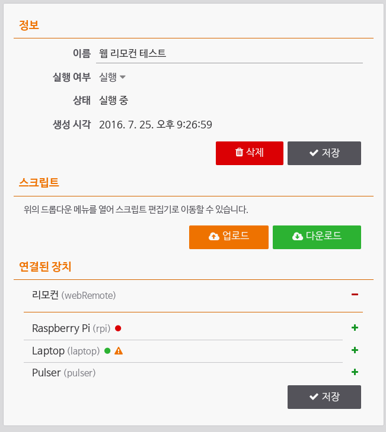

스크립트를 선택하면 자세한 사항이 표시됩니다. 현재 정보가 표시되고, 스크립트를 파일로
다운로드받거나, 연결된 장치를 추가하거나 제거할 수 있습니다.

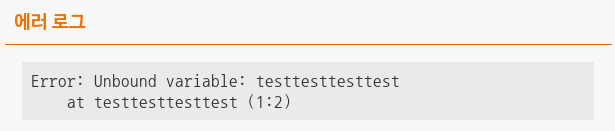

스크립트 오류도 이 화면에서 볼 수 있습니다.

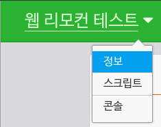

스크립트가 선택된 상태에서는 왼쪽 위의 제목이 드롭다운 메뉴로 변하는데, 누르면 스크립트를
수정하거나 콘솔로 이동할 수 있습니다.

### 스크립트 수정하기
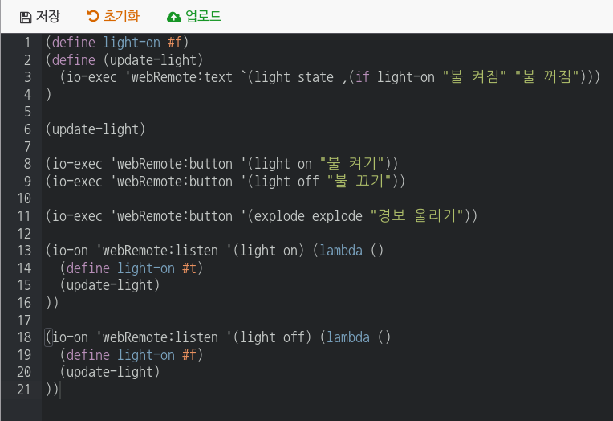

'스크립트'를 클릭해서 들어가면 스크립트를 직접 수정할 수 있는 화면이 나타납니다. 간단한
스크립트 편집기를 제공해서 쉽게 편집할 수 있습니다.

각 스크립트 파일은 임시 공간과 실제 동작하는 스크립트 두 가지가 있는데, 아래에 보여지는
내용은 임시 공간의 코드입니다. 위에 있는 저장, 초기화 버튼을 사용해서 임시 공간에 저장하거나
업로드 했던 스크립트를 원래대로 돌릴 수 있고, 업로드 버튼을 사용해 실제로 스크립트를 올릴
수 있습니다.

### 콘솔 사용하기
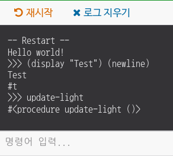

'콘솔'을 클릭해서 들어가면 스크립트 콘솔이 나타나는데, 스크립트 상에서 출력되는 메시지를 볼
수 있고 아래의 입력 창을 통해 스크립트를 직접 실행할 수도 있습니다 (REPL).

또, 재시작 버튼을 눌러 스크립트를 다시 시작할 수도 있습니다.

# 프로그래밍 가이드
IoTLogic은 스크립트를 작성할 수 있는 언어로 Scheme (R<sup>6</sup>RS)를 지원합니다.
R6RS에 대한 자세한 사항은 [레퍼런스](http://www.r6rs.org/final/html/r6rs/r6rs.html)를
참조해 주세요.

## 구성
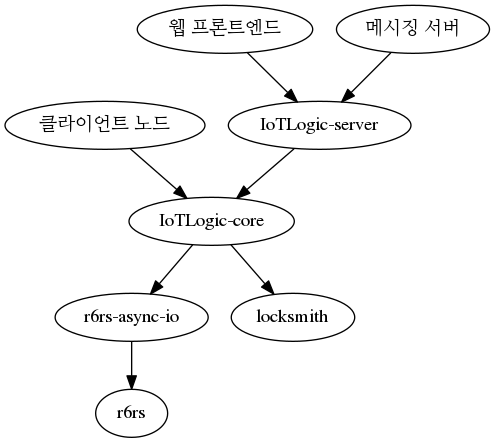

- [IoTLogic-server](https://github.com/yoo2001818/IoTLogic-server) -
  웹 프론트엔드와 메시징 서버
- [IoTLogic-core](https://github.com/yoo2001818/IoTLogic-core) -
  분산 Scheme 환경 코어와 클라이언트 노드
- [r6rs](https://github.com/yoo2001818/r6rs) -
  R6RS Scheme 인터프리터
- [r6rs-async-io](https://github.com/yoo2001818/r6rs-async-io) -
  r6rs (라이브러리)를 위한 비동기 I/O 커넥터
- [r6rs-async-io-library](https://github.com/yoo2001818/r6rs-async-io-library) -
  r6rs-async-io용 비동기 I/O 라이브러리 모음
- [locksmith](https://github.com/yoo2001818/locksmith) -
  Lockstep 상태 기계 동기화 라이브러리
- [locksmith-connector-ws](https://github.com/yoo2001818/locksmith-connector-ws) -
  locksmith용 WebSocket 프로토콜

## 주의 사항

- R6RS 구현이 완전히 되지 않아 일부 명령은 동작하지 않을 수도 있습니다. 대표적으로 복소수,
  벡터, letrec, call/cc등을 사용할 수 없습니다. 자세한 사항은
  [여기](https://github.com/yoo2001818/r6rs#implementation-status)를 참조하세요.
- 장치가 새로 연결되거나 접속을 해제하면 인터프리터가 다시 시작됩니다.

## IoTLogic 내장 함수

- `(device-list)` - 현재 문서에 접속한 모든 장치들의 ID 리스트를 반환합니다.
- `(device-alias <장치 ID>)` - 해당 장치의 별명을 반환합니다.
- `(device-exists <장치 ID)` - 해당 장치의 접속 여부를 반환합니다.

### I/O 사용하기

- `(io-exec <타입> <옵션> <콜백>)` - 해당 I/O를 비동기로 한번만 실행하고
  이벤트 ID를 반환합니다.
- `(io-once <타입> <옵션> <콜백>)` - `io-exec`와 같습니다.
- `(io-on <타입> <옵션> <콜백>)` - 해당 I/O에서 지속적으로 이벤트를 수신합니다. 이벤트
  ID를 반환합니다.
- `(io-cancel <이벤트 ID>)` - 해당 I/O 실행을 취소합니다.

I/O 타입은 문자열이나 심볼, 리스트가 될 수 있습니다. 문자열이나 심볼의 경우에는
`device:test`처럼 : 문자로 장치 ID와 실행할 I/O를 구분합니다. 리스트의 경우에는
`'(device test)`처럼 첫번째 항목이 장치 ID, 두번째 항목이 실행할 I/O가 됩니다.

콜백은 필요하지 않다면 뺄 수도 있습니다. 하지만 옵션은 필요하지 않더라도 빈 리스트
등으로 꼭 채워넣어야 합니다.

```scheme
(io-exec 'laptop:notifier/send "안녕하세요!")
(io-exec 'laptop:process/exec "shutdown -s -t 0" (lambda ()
  (display "실행 완료")
  (newline)
))
(io-exec 'laptop:getDate '() (lambda (date)
  (display "현재 시간은")
  (display date)
  (newline)
))
```

## I/O 패키지 레퍼런스
I/O 패키지는 npm을 통해 배포되고, 웹 프론트엔드에서 장치 하단의 'I/O 패키지' 항목을 통해
사용할 항목을 선택할 수 있습니다.

다음은 빌트인 I/O 함수의 목록입니다.

- `functions () -> (리스트)` - 해당 장치의 모든 I/O 함수 리스트를 반환합니다.
- `timer 딜레이 -> ()` - 해당 장치에서 지정한 시간이 지난 뒤에 명령을 실행합니다.
  `io-on`을 사용하면 일정 시간마다 계속 호출됩니다.
- `getDate () -> (시간)` - 해당 장치의 현재 시간을 타임스탬프 값으로 반환합니다.

```scheme
(io-exec 'laptop:functions '() (lambda (functionList)
  (display functionList)
  (newline)
))
```

### r6rs-async-io-cron
cron을 IoTLogic 상에서 사용할 수 있게 해주는 패키지입니다.

- `cron/start 패턴 -> ()` - 해당 패턴이 일치하는 시간에 콜백을 호출합니다.

### r6rs-async-io-node-notifier
컴퓨터의 화면에 알림을 띄울 수 있게 해줍니다.

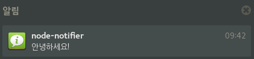

- `notifier/send 옵션 -> ()` - 해당 설정에 맞춰 알림을 띄웁니다. 옵션은 문자열이나
  association 리스트가 될 수 있습니다. association 리스트를 사용한다면 인자가 그대로
  [node-notifier](https://github.com/mikaelbr/node-notifier)로 전달됩니다.

```scheme
(io-exec "laptop:notifier/send" '(
  (title "Starting notification")
  (message "This is a notification")
))
```

### r6rs-async-io-process
프로세스를 실행할 수 있게 해줍니다.

- `process/exec (명령 옵션) 또는 명령 -> ((message code signal) stdout stderr)` -
  프로세스를 실행하고 완료될 때까지 기다리다 실행이 끝나면 반환합니다. 앞의
  `(message code signal)`은 프로세스가 0이 아닌 값을 반환하면 나오는 내용으로, 0을
  반환했다면 빈 리스트가 출력됩니다.
  옵션은 [Node.js](https://nodejs.org/api/child_process.html#child_process_child_process_exec_command_options_callback)의
  options 값을 그대로 따릅니다.
- `process/spawn ((명령 인자 ...) 옵션) -> (ID)` -
  프로세스를 실행하고 바로 ID를 반환합니다. 이 ID는 stdout에 이벤트를 걸거나 stdin으로
  출력하는데 쓰입니다. `process/spawn`은 꼭 `io/on`을 사용해야 합니다.
  옵션은 [Node.js](https://nodejs.org/api/child_process.html#child_process_child_process_spawn_command_args_options)의
  options 값을 그대로 따릅니다.
- `process/writeStdin (ID 데이터) -> ()` - 해당 프로세스의 stdin에 데이터를 넣습니다.
- `process/onStdout (ID) -> (데이터)` - 해당 프로세스의 stdout에서 나오는 데이터를
  수신합니다. 프로세스가 닫히면 데이터가 `()`으로 콜백이 한번 호출됩니다.
- `process/onStderr (ID) -> (데이터)` - 해당 프로세스의 stderr에서 나오는 데이터를
  수신합니다. 프로세스가 닫히면 데이터가 `()`으로 콜백이 한번 호출됩니다.
- `process/onClose (ID) -> (코드)` - 해당 프로세스가 종료되면 호출됩니다.
- `process/kill` (ID 시그널) -> ()` - 해당 프로세스에 kill 신호를 보냅니다. 시그널은
  지정되지 않으면 `SIGTERM`이 기본값으로 지정됩니다.

```scheme
(io-on "laptop:process/spawn" '(("dbus-monitor" "--session")) (lambda (process)
  (io-on "laptop:process/onStdout" process (lambda (data)
    (display data)
  ))
  (io-on "laptop:process/onClose" process (lambda (code signal)
    (display "Closed ")
    (display code)
    (display signal)
    (newline)
  ))
))
```

### r6rs-async-io-remote

### r6rs-async-io-wiring-pi

### 패키지 만들기

## 장치 레퍼런스

### 웹 리모컨

# 라이센스

```
The MIT License (MIT)

Copyright (c) 2016 Duknam Yoo

Permission is hereby granted, free of charge, to any person obtaining a copy
of this software and associated documentation files (the "Software"), to deal
in the Software without restriction, including without limitation the rights
to use, copy, modify, merge, publish, distribute, sublicense, and/or sell
copies of the Software, and to permit persons to whom the Software is
furnished to do so, subject to the following conditions:

The above copyright notice and this permission notice shall be included in all
copies or substantial portions of the Software.

THE SOFTWARE IS PROVIDED "AS IS", WITHOUT WARRANTY OF ANY KIND, EXPRESS OR
IMPLIED, INCLUDING BUT NOT LIMITED TO THE WARRANTIES OF MERCHANTABILITY,
FITNESS FOR A PARTICULAR PURPOSE AND NONINFRINGEMENT. IN NO EVENT SHALL THE
AUTHORS OR COPYRIGHT HOLDERS BE LIABLE FOR ANY CLAIM, DAMAGES OR OTHER
LIABILITY, WHETHER IN AN ACTION OF CONTRACT, TORT OR OTHERWISE, ARISING FROM,
OUT OF OR IN CONNECTION WITH THE SOFTWARE OR THE USE OR OTHER DEALINGS IN THE
SOFTWARE.
```
